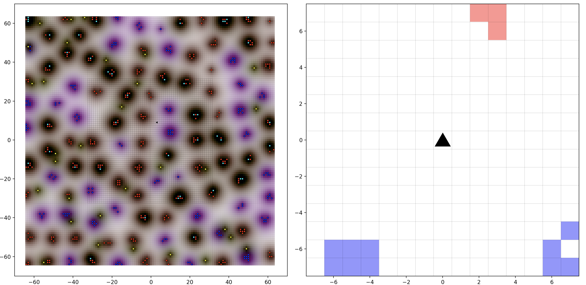

# COMP579 Project Template
## Virtual Environment
Create a virtual environment with the dependencies found in `environment.yml`. 

```
git clone https://github.com/COMP579TA/COMP579-Project-Template
cd COMP579-Project-Template
conda env create environment.yml -n my-venv
conda activate my-venv
```
## Training the agent
The agent can be trained by running `python3 train_agent.py --group GROUP_MJ1`

## Domain 1: Mujoco 
MuJoCo is a general purpose physics engine that aims to facilitate research and development in robotics. It stands for Multi-Joint dynamics with contact. Mujoco has different environments from which we use (Hopper)[https://gym.openai.com/envs/Hopper-v2/]. 
Hopper has a  11-dimensional state space, that is position and velocity of each joint. The initial states are uniformly randomized. The action is a 3-dimensional continuous space. This environment is terminated when the agent falls down. 


### Mujoco Installation
We'll be using mujoco210 in this project. This page contains the mujoco210 releases:
https://github.com/deepmind/mujoco/releases/tag/2.1.0
Download the distribution compatible to your OS and unzip it inside ~/.mujoco/
 
#### GPU Machines
After activating the virtual environment, change the environment variable as:
```
conda env config vars set LD_LIBRARY_PATH=/usr/local/pkgs/cuda/latest/lib64:$HOME/.mujoco/mujoco210/bin:/usr/lib/nvidia-460:/usr/lib/nvidia
```

Note that the GPU driver `nvidia-460` is only applicable for machines with GPUs and is machine specific.

#### CPU Machines
For installing mujoco on a CPU only machine do this:

```
fill this part
```

#### Google Colab

Install the required packages to run mujoco environment 
```
!apt-get install -y \
    libgl1-mesa-dev \
    libgl1-mesa-glx \
    libglew-dev \
    libosmesa6-dev \
    software-properties-common

!apt-get install -y patchelf
```
```
!pip3 install gym
!pip install free-mujoco-py
```
You can check the following notebook for further info: https://colab.research.google.com/drive/1Zmr96imxqHnbauXf8KbzKgwuF7TROc9F?usp=sharing 

## Domain 2: Jellybean world
<p align="center">
  
</p>

### Environment description
[Jelly bean world](https://arxiv.org/pdf/2002.06306.pdf) is a testbed that provides infinite 2D gridworlds with objects in it to test continual learning agents. For this project, you are given a custom jelly bean environment which has 4 different kinds of objects - Apples, Bananas, Jelly beans, and Truffles. These objects are distributed throughout the grid according to an unknown probability distribution. Some of these objects appear together, for instance, Apples and Truffles are always together. Some objects appear in clusters, for example, Apples and Jelly beans appear in seperate clusters, while some objects, like bananas, are uniformly distributed. Although the original aim of this environment is to train a continual learning RL agent (an RL agent that continually learns in the changing world) in an infinite world, for simplicity, you will be working in a traditional episodic setting. Each episode has `5000` timesteps in this task and your job is to train an RL agent that can gather as many rewards as it can in an episode. Rewards are obtained by collecting various objects in the environment:

|**Object**|**Reward**|
| ----------- | ----------- |
|Apple|+1.0|
|Banana|+0.1|
|Jelly bean|-1.0|
|Truffle|-0.1|

The environment provides several kinds of information to the agent that form an observation space - scent, vision, and features.
- **Scent**: Each object has different kinds of scent that is diffused throughout the grid:

|**Object**|**Scent**|
| ----------- | ----------- |
|Apple|[1.64, 0.54, 0.4]|
|Banana|[1.92, 1.76, 0.4]|
|Jelly bean|[0.68, 0.01, 0.99]|
|Truffle|[8.4, 4.8, 2.6]|

At any point in time, agent can perceive scent at its location (vector of size 3), which is a mixture of scents diffused from various objects and nearby cells.

- **Vision**: Agent can observe its surroundings as a 15x15 RGB image, where different objects have different colours.

- **Features**: While working with vision directly is interesting, it could be challenging due to computation limiations. So, we provide you with features to train your agent. Feature vector is a binary vector of length `15x15x4 (900)`, where the first `15x15 (225)` elements indicate the presence of the first object, the next `225` bits indicate the presence of the second object, and so on.
Each part of the observation space is complementary to the other and you are free to use any combinations of these spaces to train your agent. You can also work with just features like the *TA-basic agent* (peforms some operations on features). Note that none of these elements provides full information of the world at a given point in time. So, you might have to construct a state to train your agent.

The agents action space consists of *4 actions* which moves the agent in one of the *4 natural directions (North, East, West, and South)*.

### Installation
#### Requirements

`GCC 4.9+, Clang 5+, or Visual C++ 14+`

`python >= 3.5, gym >= 0.22.0, numpy, matplotlib, scikit-image >= 0.19.2, scikit-learn >= 1.0.2, scipy >= 1.8.0, torch >= 1.10.1, torchvision >= 0.10.0`

#### Setup JBW
You can do the following installation without hassle if you have configured your system to establish `ssh` connection with github (https://docs.github.com/en/authentication/connecting-to-github-with-ssh/about-ssh). Otherwise, you will have to use `https` links to work with git.

1. After installing the requirements, clone the [JBW repo](https://github.com/NishanthVAnand/jelly-bean-world):
`git clone git@github.com:NishanthVAnand/jelly-bean-world.git`

2. Install the Jbw repo:
```
cd jelly-bean-world
git submodule update --init --recursive
cd api/python
python setup.py install
```

Mac M1 users will use `setup_m1.py` instead. You are required to run `git submodule update --init --recursive` only the first time and subsequently you will run `git submodule update --remote` instead, which pulls the latest dependencies required for the Jbw package. For some of you working *without* ssh connection, the above commands might not work. In that case run:

```
cd jelly-bean-world

rm -rf jbw/deps/core
git rm jbw/deps/core
git submodule add https://github.com/asaparov/core.git jbw/deps/core

rm -rf jbw/deps/math
git rm jbw/deps/math
git submodule add https://github.com/asaparov/math.git jbw/deps/math

cd api/python
python setup.py install
```
Subsequently, you can use `git submodule update --remote`.

3. Testing:
Jbw must have installed now. You can test it by running the below code in a python interpreter.

``` python
import jbw
import gym

env = gym.make("JBW-COMP579-obj-v1")
curr_obs = env.reset()
```
Hurray! You can now fill up the `agent.py` file in the project template folder to train your agent.

### Miscellaneous

1. Set some flags to visualize your agent:

``` python
import jbw
import gym

env = gym.make("JBW-COMP579-obj-v1", render=True)
curr_obs = env.reset()
done = False
while not done:
    env.render(mode="matplotlib")
    next_obs, reward, done, _ = env.step(env.action_space.sample())
```
You can now see what your agent is doing in the environment. Use this feature only discretely as the training times can impact significantly while visualizing.

2. Observation space:
`curr_obs` and `next_obs` are a tuple of 4 elements which contains different informations as described earlier. You can unpack them as:
`curr_scent, curr_vision, curr_features, _ = curr_obs`, where `curr_scent` is a sample from `scent_space`, `curr_vision` is a sample from `vision_space`, and curr_features` is a sample from `feature_space`.

3. Wrappers:
At times, you may need to perform some operations on your input space, like converting RGB images to grayscale or stacking `n` previous observations to form a state, etc. All these operations has to go inside your `agent.py` file. **Any operations performed outside the `agent.py` file could throw errors while evaluating your agent, which could give you a score of `0`**. We provide a couple of examples for wrappers, but these **can't** be used as is. You will have to rewrite the code to fit them inside your `agent.py` file to use it.

``` python
import gym
from gym import Wrapper
from gym.wrappers import LazyFrames
from gym.spaces import Box

from collections import deque
import numpy as np

import torch
from torchvision import transforms as T

class FrameStack(Wrapper):
	"""
	Observation wrapper that stacks the observations in a rolling manner.
	For example, if the number of stacks is 4, then the returned observation contains
	the most recent 4 observations. For environment 'Pendulum-v0', the original observation
	is an array with shape [3], so if we stack 4 observations, the processed observation
	has shape [4, 3].
	note::
		To be memory efficient, the stacked observations are wrapped by :class:`LazyFrame`.
	note::
		The observation space must be `Box` type. If one uses `Dict`
		as observation space, it should apply `FlattenDictWrapper` at first.
	Example::
		>>> import gym
		>>> env = gym.make('PongNoFrameskip-v0')
		>>> env = FrameStack(env, 4)
		>>> env.observation_space
		Box(4, 210, 160, 3)
	Args:
		env (Env): environment object
		num_stack (int): number of stacks
		lz4_compress (bool): use lz4 to compress the frames internally
	"""
	def __init__(self, env, num_stack, lz4_compress=False):
		super(FrameStack, self).__init__(env)
		self.num_stack = num_stack
		self.lz4_compress = lz4_compress

		self.vision_frames = deque(maxlen=num_stack)
		self.scent_frames = deque(maxlen=num_stack)
		self.feature_frames = deque(maxlen=num_stack)

		low = np.repeat(self.vision_space.low[np.newaxis, ...], num_stack, axis=0)
		high = np.repeat(self.vision_space.high[np.newaxis, ...], num_stack, axis=0)
		self.vision_space = Box(low=low, high=high, dtype=self.vision_space.dtype)
		
		scent_low = np.repeat(self.scent_space.low[np.newaxis, ...], num_stack, axis=0)
		scent_high = np.repeat(self.scent_space.high[np.newaxis, ...], num_stack, axis=0)
		self.scent_space = Box(low=scent_low, high=scent_high, dtype=self.scent_space.dtype)

		feature_low = np.repeat(self.feature_space.low[np.newaxis, ...], num_stack, axis=0)
		feature_high = np.repeat(self.feature_space.high[np.newaxis, ...], num_stack, axis=0)
		self.feature_space = Box(low=feature_low, high=feature_high, dtype=self.feature_space.dtype)

	def _get_vision(self):
		assert len(self.vision_frames) == self.num_stack, (len(self.vision_frames), self.num_stack)
		return LazyFrames(list(self.vision_frames), self.lz4_compress)
	
	def _get_scent(self):
		assert len(self.scent_frames) == self.num_stack, (len(self.scent_frames), self.num_stack)
		return LazyFrames(list(self.scent_frames), self.lz4_compress)

	def _get_feature(self):
		assert len(self.feature_frames) == self.num_stack, (len(self.feature_frames), self.num_stack)
		return LazyFrames(list(self.feature_frames), self.lz4_compress)

	def step(self, action):
		state, reward, done, info = self.env.step(action)
		scent, observation, feature, moved = state
		self.vision_frames.append(observation)
		self.scent_frames.append(scent)
		self.feature_frames.append(feature)
		return ( self._get_scent(), self._get_vision(), self._get_feature(), moved), reward, done, info

	def reset(self, **kwargs):
		state = self.env.reset(**kwargs)
		scent, observation, feature, moved = state
		[self.vision_frames.append(observation) for _ in range(self.num_stack)]
		[self.scent_frames.append(scent) for _ in range(self.num_stack)]
		[self.feature_frames.append(feature) for _ in range(self.num_stack)]
		return (self._get_scent(), self._get_vision(), self._get_feature(), moved)

class ObservationWrapper(Wrapper):
	def reset(self, **kwargs):
		state = self.env.reset(**kwargs)
		scent, obs, feature, moved = state
		return (self.get_scent(scent), self.get_observation(obs), self.get_feature(feature), moved)

	def step(self, action):
		state, reward, done, info = self.env.step(action)
		scent, obs, feature, moved = state
		return (self.get_scent(scent), self.get_observation(obs), self.get_feature(feature), moved), reward, done, info

	def permute_orientation(self, observation):
		# permute [H, W, C] array to [C, H, W] tensor
		observation = np.transpose(observation, (2, 0, 1))
		observation = torch.tensor(observation.copy(), dtype=torch.float)
		return observation

	def get_observation(self, observation):
		raise NotImplementedError

	def get_scent(self, scent):
		raise NotImplementedError

	def get_feature(self, feature):
		raise NotImplementedError

class GrayScaleObservation(ObservationWrapper):
	def __init__(self, env):
		super().__init__(env)
		obs_shape = self.vision_space.shape[:2]
		self.vision_space = Box(low=0, high=255, shape=obs_shape, dtype=np.uint8)

	def get_observation(self, observation):
		if isinstance(observation, torch.Tensor):
			observation = observation.numpy()
		observation = self.permute_orientation(observation)
		transform = T.Compose([T.ToPILImage(), T.Grayscale(), T.ToTensor()])
		observation = transform(observation).squeeze()
		return observation

	def get_scent(self, scent):
		return scent

	def get_feature(self, feature):
		return feature
```
